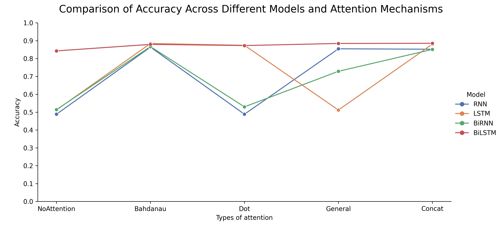
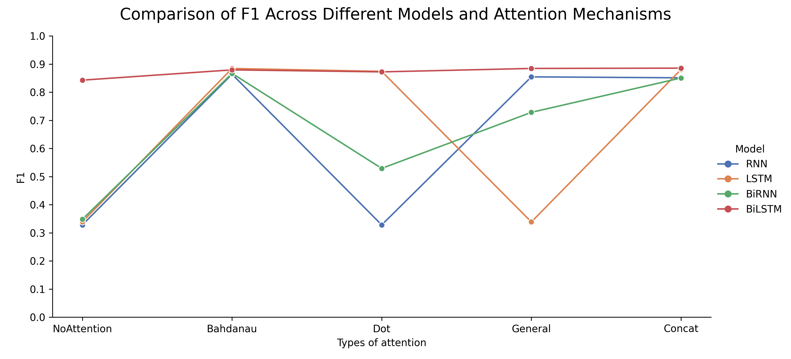
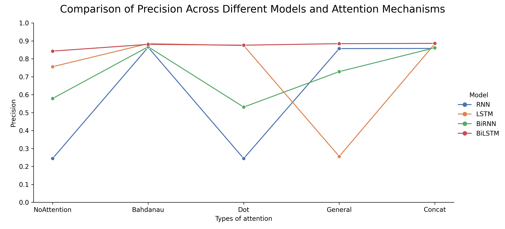
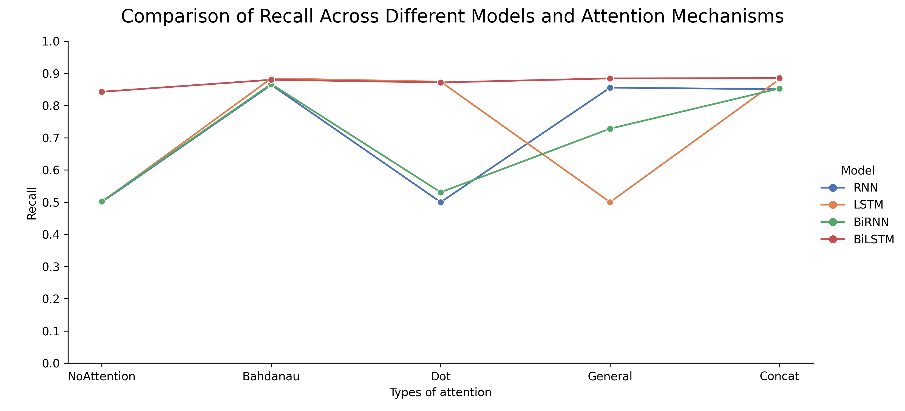
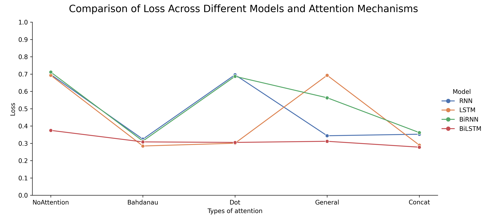
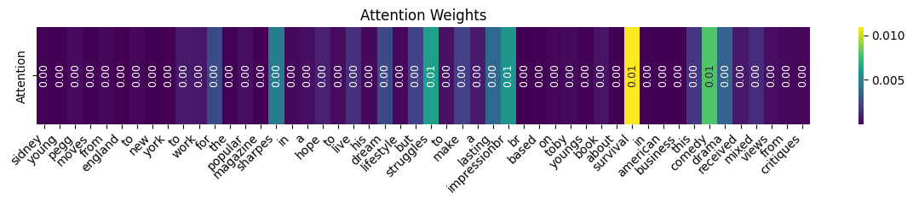

# Sentiment Analysis with Attention Mechanisms

This project implements and compares **20 deep learning models** for binary sentiment classification on a sampled IMDB reviews dataset, with a focus on **attention mechanisms**.

---

## Project Structure

```
.
├── main.py               # Entrypoint to train and evaluate models
├── train.py              # Training loop
├── preprocess.py         # Preprocessing and tokenization
├── plots.py              # Generates evaluation plots
├── README.md
│
├── attention/            # Attention mechanisms
│   ├── BahdanauAttention.py
│   ├── LuongConcatAttention.py
│   ├── LuongDotAttention.py
│   └── LuongGeneralAttention.py
│
├── models/               # Model architectures
│   ├── RNN_Model.py
│   ├── LSTM_Model.py
│   ├── BiRNN_Model.py
│   ├── BiLSTM_Model.py
│   └── EmbeddingLayer.py
│
├── utils/                # Utilities and helpers
│   ├── preprocess_utils.py
│   ├── visualise_attention.py
│   ├── log_to_csv.py
│   └── log_to_txt.py
│
├── output/               # Logs from training loop
│   ├── metrics_log.csv
│   └── training_logs.txt
│
├── plots/                # Plots for each metric
│   ├── Accuracy.png
│   ├── F1.png
│   ├── Loss.png
│   ├── Precision.png
│   ├── Recall.png
│   ├── attention_visualisation.png
│   ├── attention_visualisation_2.png
│   └── attention_visualisation_3.png
│
└── tests/
    └── model.ipynb
```

---

## Dataset

* [IMDB Sentiment Dataset](https://huggingface.co/datasets/stanfordnlp/imdb)
* Merged train and test sets → **50,000** total
* Sampled **30,000** reviews for faster training
* Labels: `positive (1)`, `negative (0)`

---

## Preprocessing Steps

### Steps

1. **Text Cleaning**

   * Lowercasing
   * Removing special characters, extra whitespace

2. **Tokenization**

   * Using basic whitespace + punctuation-aware tokenizer
   * Tokenized text is padded to the length of the longest sequence sequence.

3. **Vocabulary Creation**

   * Built `word2idx` and `idx2word` dictionaries
   * special tokens: `<PAD>`, `<UNK>`

4. **GloVe Embedding Integration**

   * Load GloVe 100-dimensional vectors (`glove.6B.100d.txt`)
   * Create an embedding matrix matching the vocab
   * Final matrix shape: `[63518, 100]`

---

## Model Variants

| Model  | Attention   | Accuracy | F1     | Precision | Recall | Loss   |
| ------ | ----------- | -------- | ------ | --------- | ------ | ------ |
| RNN    | NoAttention | 0.4882   | 0.3280 | 0.2441    | 0.4998 | 0.6977 |
| RNN    | Bahdanau    | 0.8638   | 0.8638 | 0.8640    | 0.8641 | 0.3240 |
| RNN    | Dot         | 0.4882   | 0.3280 | 0.2441    | 0.4998 | 0.6958 |
| RNN    | General     | 0.8545   | 0.8544 | 0.8568    | 0.8555 | 0.3437 |
| RNN    | Concat      | 0.8520   | 0.8510 | 0.8577    | 0.8505 | 0.3525 |
| LSTM   | NoAttention | 0.5118   | 0.3389 | 0.7559    | 0.5002 | 0.6929 |
| LSTM   | Bahdanau    | 0.8843   | 0.8842 | 0.8844    | 0.8841 | 0.2844 |
| LSTM   | Dot         | 0.8740   | 0.8739 | 0.8739    | 0.8740 | 0.3005 |
| LSTM   | General     | 0.5117   | 0.3385 | 0.2558    | 0.5000 | 0.6928 |
| LSTM   | Concat      | 0.8807   | 0.8806 | 0.8835    | 0.8817 | 0.2897 |
| BiRNN  | NoAttention | 0.5138   | 0.3481 | 0.5786    | 0.5023 | 0.7113 |
| BiRNN  | Bahdanau    | 0.8668   | 0.8667 | 0.8668    | 0.8667 | 0.3130 |
| BiRNN  | Dot         | 0.5295   | 0.5289 | 0.5308    | 0.5306 | 0.6867 |
| BiRNN  | General     | 0.7285   | 0.7282 | 0.7284    | 0.7281 | 0.5630 |
| BiRNN  | Concat      | 0.8510   | 0.8504 | 0.8614    | 0.8530 | 0.3619 |
| BiLSTM | NoAttention | 0.8428   | 0.8427 | 0.8428    | 0.8427 | 0.3746 |
| BiLSTM | Bahdanau    | 0.8792   | 0.8792 | 0.8804    | 0.8799 | 0.3082 |
| BiLSTM | Dot         | 0.8727   | 0.8721 | 0.8758    | 0.8716 | 0.3051 |
| BiLSTM | General     | 0.8843   | 0.8843 | 0.8843    | 0.8842 | 0.3116 |
| BiLSTM | Concat      | 0.8855   | 0.8854 | 0.8859    | 0.8851 | 0.2777 |


> 📊 Total: **20 models**

---

## 🛠Implementation Details

* **Framework**: PyTorch
* **Embeddings**: Pretrained GloVe (100D)
* **Modular Attention**: Usage of custom made Attention classes (checkout /attention)
* **Logs**: Training logs and metrics saved to CSV/text files

---

## Performance Plots

Each plot visualizes:

* **X-axis**: Attention types
* **Y-axis**: Metric value
* **Hue**: Model type (RNN, LSTM, Bi-RNN, Bi-LSTM)

### 🔽 Accuracy Across Models



### 🔽 F1 Score



### 🔽 Precision



### 🔽 Recall



### 🔽 Loss



---

## Sample Attention Weights Visualization

To understand **which words the model focuses on** during prediction.

> visualize_attention(model, test_loader, idx2word, device, num_samples=1, max_tokens=50, pad_idx=word2idx['<PAD>'])
- Filters out PAD token and considers only 50 tokens for easier visualization



---

Author: P S Harish

